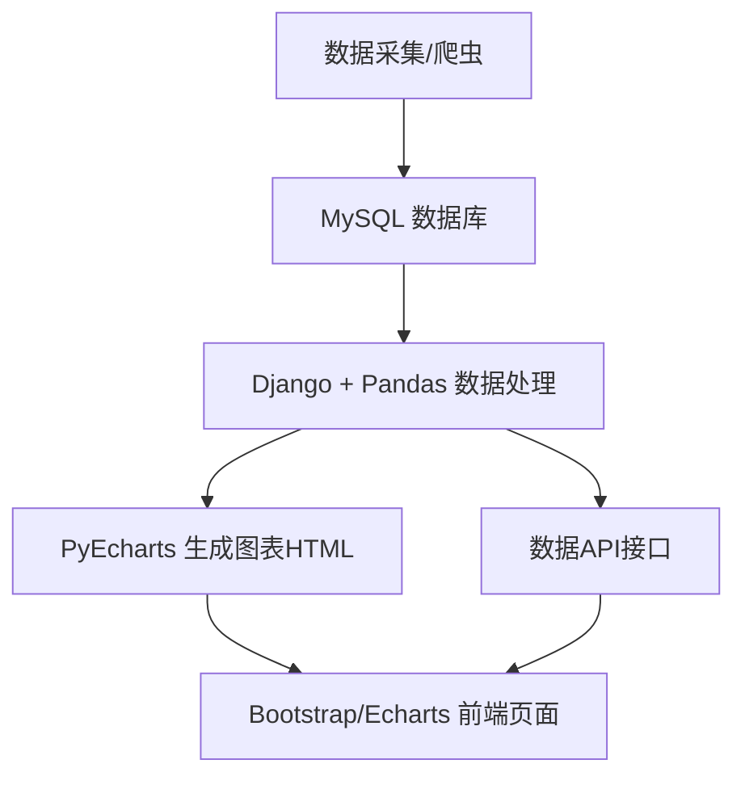

# 二手房分析可视化大屏——项目说明

## 一、项目简介与效果展示

### 1.1 项目背景

随着大数据和人工智能技术的不断发展，数据可视化在各行各业中扮演着越来越重要的角色。对于房地产行业而言，二手房市场的数据量庞大、结构复杂，如何高效地分析和展示这些数据，帮助用户快速洞察市场趋势，成为了一个亟需解决的问题。

本项目以广西地区二手房数据为基础，构建了一个集数据采集、处理、分析与可视化于一体的“二手房分析可视化大屏”。该大屏不仅能够直观展示各城市房源数量、均价分布、户型结构、关键词热度等多维度信息，还通过3D地图、3D柱状图等高级可视化手段，提升了数据的表现力和交互性。

### 1.2 项目效果展示

项目首页为“二手房分析可视化大屏”，整体采用深色科技风格，主色调为青色渐变，兼具美观与实用性。页面主要分为以下几个区域：

- **顶部大标题**：采用渐变高亮字体，突出科技感。
- **左侧柱状图**：展示各城市房源数量、均价对比。
- **中部3D地图**：以三维形式展示广西各城市二手房分布，直观反映区域差异。
- **右侧雷达图、饼图、词云**：分别展示户型数量、户型分布和标题关键词热度。
- **底部3D柱状图与折线图**：多维度展示不同城市、方位的房价分布及建造年份与均价的关系。

页面布局自适应，兼容不同分辨率，适合大屏展示和日常数据分析。

#### 1.3 功能亮点

- **多图联动**：同一页面集成多种可视化图表，信息丰富，便于对比分析。
- **3D可视化**：利用 Echarts-GL 实现三维地图和柱状图，提升数据表现力。
- **关键词词云**：自动提取房源标题高频词，洞察市场关注点。
- **响应式布局**：结合 Bootstrap 4 和自定义 Flex 布局，页面美观且适配多终端。
- **高性能数据处理**：后端用 Pandas 高效处理大数据量，保证页面响应速度。
- **接口化设计**：支持前后端分离和异步数据加载，便于后续扩展。

> **效果截图**
>


---

## 二、技术栈与架构设计

### 2.1 后端技术选型

- **Python 3**：主流的后端开发语言，生态丰富，易于数据处理与分析。
- **Django**：高效的 Web 框架，支持快速开发、ORM、模板渲染、路由管理等。
- **Pandas**：强大的数据分析与处理库，适合对结构化数据进行统计、分组、清洗。
- **PyEcharts**：基于 Echarts 的 Python 可视化库，能生成高质量、可嵌入的图表 HTML。
- **pymysql**：MySQL 数据库连接驱动，便于 Django 之外的数据操作。

### 2.2 前端技术选型

- **Bootstrap 4**：流行的响应式前端框架，简化页面布局与美化，兼容多终端。
- **Echarts & Echarts-GL**：百度开源的可视化库，支持丰富的 2D/3D 图表类型，交互性强。
- **HTML5 + CSS3**：现代网页开发基础，配合自定义样式实现科技感大屏。

### 2.3 架构设计与整体流程

本项目采用“前后端协作、数据接口驱动”的架构模式，整体流程如下：

1. **数据采集**：通过爬虫抓取二手房数据，存入 MySQL 数据库。
2. **后端处理**：Django 视图层用 Pandas 读取、清洗、统计数据库数据。
3. **图表生成**：后端用 PyEcharts 生成各类图表的 HTML 片段，或通过 API 提供数据。
4. **前端展示**：Bootstrap 4 负责页面布局与美化，Echarts 负责图表渲染与交互。
5. **数据接口**：Django 提供 JSON 数据接口，支持前端异步加载和动态刷新。

#### 架构流程图（示意）



#### 关键设计思想

- **分层解耦**：数据采集、处理、可视化、展示各自独立，便于维护和扩展。
- **接口驱动**：所有数据和图表均可通过接口获取，支持前后端分离和多端适配。
- **高可扩展性**：可轻松增加新的数据维度、图表类型或前端展示方式。
- **美观与实用并重**：兼顾数据分析的严谨性与大屏展示的视觉冲击力。

---

## 三、环境搭建与依赖安装

### 3.1 Python 环境准备

建议使用 Python 3.7 及以上版本。可通过 Anaconda、Miniconda 或官方安装包进行环境配置。

```bash
# 推荐使用虚拟环境管理依赖
python -m venv venv
source venv/bin/activate  # Windows 下为 venv\Scripts\activate
```

### 3.2 数据库准备

本项目使用 MySQL 数据库存储二手房数据。请提前安装 MySQL 5.7 及以上版本，并创建数据库和表结构。

```sql
CREATE DATABASE ershoufang DEFAULT CHARSET utf8mb4;

-- 示例表结构
CREATE TABLE ershoufang_list (
    id INT PRIMARY KEY AUTO_INCREMENT,
    标题 VARCHAR(255),
    城市 VARCHAR(50),
    均价 VARCHAR(50),
    户型 VARCHAR(50),
    方位 VARCHAR(50),
    时间 VARCHAR(50)
    -- 可根据实际数据增加字段
);
```

> **数据采集**：可通过自定义爬虫抓取二手房网站数据，或使用已有数据集导入。

### 3.3 依赖包安装

项目依赖主要包括 Django、Pandas、PyEcharts、pymysql 等。建议使用 requirements.txt 管理依赖。

```bash
pip install django pandas pyecharts pymysql
```

如需完整依赖，可在项目根目录下创建 requirements.txt：

```txt
django
pandas
pyecharts
pymysql
```

然后一键安装：

```bash
pip install -r requirements.txt
```

### 3.4 项目结构说明

项目采用标准 Django 工程结构，主要目录如下：

```
visual-screen/
  └── myproject/
      ├── db.sqlite3
      ├── manage.py
      ├── myapp/
      │   ├── __init__.py
      │   ├── admin.py
      │   ├── apps.py
      │   ├── migrations/
      │   ├── models.py
      │   ├── tests.py
      │   ├── views.py         # 主要业务逻辑与数据接口
      ├── myproject/
      │   ├── __init__.py
      │   ├── asgi.py
      │   ├── settings.py      # 配置文件
      │   ├── templates/
      │   │   └── city_table.html  # 前端主页面
      │   ├── urls.py         # 路由配置
      │   ├── wsgi.py
  └── visual-screen.iml
```

- `views.py`：后端数据处理、图表生成、API 实现
- `city_table.html`：前端主页面，集成所有可视化图表
- `urls.py`：路由配置，定义页面与接口访问路径
- `settings.py`：数据库、静态文件等全局配置

---

## 四、数据采集与处理

### 4.1 数据来源与采集方式

本项目的数据主要来源于主流二手房信息网站（如链家、安居客等）。通过自定义爬虫程序，定期抓取广西各城市的二手房房源信息，包括标题、城市、均价、户型、方位、建造年份等字段。

#### 爬虫实现简述

- 使用 Python 的 requests、BeautifulSoup、lxml 等库，模拟浏览器请求，解析网页结构，提取所需字段。
- 针对不同城市和分页，自动遍历抓取，去重并存入 MySQL 数据库。
- 可设置定时任务，定期更新数据，保证数据的时效性和完整性。

> **注意：** 爬虫仅用于学习和研究，请遵守目标网站的 robots 协议和相关法律法规。

### 4.2 数据库表结构设计

数据表 `ershoufang_list` 主要字段如下：

| 字段名 | 类型 | 说明 |
| ------ | ---- | ---- |
| id | INT | 主键，自增 |
| 标题 | VARCHAR(255) | 房源标题 |
| 城市 | VARCHAR(50) | 所在城市 |
| 均价 | VARCHAR(50) | 单价（元/㎡） |
| 户型 | VARCHAR(50) | 房屋户型 |
| 方位 | VARCHAR(50) | 朝向 |
| 时间 | VARCHAR(50) | 建造年份或挂牌时间 |

可根据实际需求扩展更多字段，如面积、小区、楼层等。

### 4.3 Pandas 数据清洗与统计

后端通过 Pandas 进行数据读取、清洗和统计分析，主要流程如下：

1. **数据读取**
   - 通过 pymysql 连接 MySQL，使用 Pandas 的 `read_sql` 方法直接读取数据表。

   ```python
   import pymysql
   import pandas as pd
   conn = pymysql.connect(host='localhost', user='root', password='123456', database='ershoufang')
   df = pd.read_sql("SELECT * FROM ershoufang_list", conn)
   conn.close()
   ```

2. **数据清洗**
   - 处理缺失值、异常值（如均价字段的提取与转换）。
   - 统一字段格式，去除重复数据。

   ```python
   def extract_price(price_str):
       match = re.search(r'(\d+(\.\d+)?)', str(price_str))
       if match:
           return float(match.group(1))
       return None
   df['均价'] = df['均价'].apply(extract_price)
   ```

3. **统计分析**
   - 统计各城市房源数量、均价、户型分布、关键词热度等。
   - 分组聚合、排序、提取高频词等操作。

   ```python
   # 统计城市房源数量
   city_counts = df['城市'].value_counts().reset_index()
   city_counts.columns = ['city', 'total']

   # 计算各城市均价
   city_avg_price = df.groupby(['城市'])['均价'].mean().round(2).reset_index()
   ```

4. **关键词提取**
   - 利用 jieba 分词和 Counter 统计标题高频词，生成词云数据。

   ```python
   import jieba
   from collections import Counter
   def get_top_keywords(texts, top_n=50):
       words = []
       for text in texts:
           words.extend(jieba.lcut(text))
       stopwords = ['的', '是', '和', '在', '有']
       words_filtered = [word for word in words if len(word) > 1 and word not in stopwords]
       return Counter(words_filtered).most_common(top_n)
   word_freq = get_top_keywords(df['标题'], top_n=50)
   ```

通过上述流程，后端可高效获得结构化、可视化所需的多维度数据，为后续图表生成和页面展示打下坚实基础。

---

## 五、后端实现详解

### 5.1 Django 视图与路由设计

后端采用 Django 框架，主要通过视图函数（views.py）处理数据、生成图表和提供数据接口。

- **主页面视图**：
  - `city_table(request)`：负责渲染主页面，整合所有图表的 HTML 片段。
- **数据接口视图**：
  - `city_data_api(request)`：返回所有可视化图表的 HTML 片段和数据，便于前端异步加载。
  - `map3d_data_api(request)`：返回广西各城市房源数量数据，支持地图等组件的动态刷新。

**路由配置**（urls.py）：

```python
from django.urls import path
from myapp import views

urlpatterns = [
    path('', views.city_table, name='city_table'),
    path('city_data_api/', views.city_data_api, name='city_data_api'),
    path('map3d_data_api/', views.map3d_data_api, name='map3d_data_api'),
]
```

### 5.2 数据接口设计与实现

- 所有接口均返回结构化数据（JSON 或 HTML 片段），便于前端异步加载和动态渲染。
- 典型接口返回示例：

```json
{
  "chart_html1": "<div>...</div>",
  "chart_html2": "<div>...</div>",
  "chart_html3": "<div>...</div>",
  "radar_html": "<div>...</div>",
  "pie_html": "<div>...</div>",
  "wordcloud_html": "<div>...</div>",
  "bar3d_map_html": "<div>...</div>",
  "line_html": "<div>...</div>"
}
```

- 通过 Django 的 `JsonResponse` 返回数据，前端可用 AJAX/fetch 获取并渲染。

### 5.3 PyEcharts 图表生成原理与代码讲解

后端利用 PyEcharts 生成各类可嵌入 HTML 的图表，主要流程如下：

1. **初始化图表对象**
   - 指定图表类型、尺寸、主题等参数。
2. **添加数据与配置项**
   - 通过 `add_xaxis`、`add_yaxis`、`add` 等方法添加数据。
   - 配置坐标轴、标题、图例、提示框、视觉映射等。
3. **渲染为 HTML 片段**
   - 使用 `render_embed()` 方法生成可直接嵌入模板的 HTML 代码。

#### 典型图表生成代码示例

```python
from pyecharts.charts import Bar
from pyecharts import options as opts

def create_bar1(city_counts):
    bar = (
        Bar(init_opts=opts.InitOpts(width="400px", height="300px"))
        .add_xaxis(city_counts['city'].tolist())
        .add_yaxis(
            series_name="房源数量",
            y_axis=city_counts['total'].tolist(),
            label_opts=opts.LabelOpts(is_show=False),
            itemstyle_opts=opts.ItemStyleOpts(color="#5470C6")
        )
        .set_global_opts(
            title_opts=opts.TitleOpts(
                title="各城市房源数量对比",
                pos_left="center",
                pos_top="20px",
                title_textstyle_opts=opts.TextStyleOpts(color="#00ffe7")
            ),
            xaxis_opts=opts.AxisOpts(name="城市"),
            yaxis_opts=opts.AxisOpts(name="房源数量（套）"),
            tooltip_opts=opts.TooltipOpts(trigger="axis"),
            legend_opts=opts.LegendOpts(is_show=False)
        )
    )
    return bar.render_embed()
```

- 其他图表（如 3D 地图、雷达图、饼图、词云、3D柱状图、折线图）均采用类似方式生成，具体可参考 views.py 中的各 `create_xxx` 函数。

### 5.4 关键实现要点

- **高性能数据处理**：Pandas 支持大数据量的高效分组、聚合、统计。
- **灵活的图表配置**：PyEcharts 支持丰富的自定义选项，满足多样化可视化需求。
- **接口化设计**：所有数据和图表均可通过接口获取，便于前端异步加载和后续扩展。
- **代码结构清晰**：视图函数、图表生成、数据处理各自独立，便于维护和升级。

---

## 六、前端页面与可视化布局

### 6.1 city_table.html 结构解析

前端主页面 `city_table.html` 采用 Django 模板语法，集成所有可视化图表区域。页面结构分为：

- **顶部大标题**：突出项目主题，采用渐变高亮字体。
- **图表区域**：分为左侧（柱状图）、中部（3D地图）、右侧（雷达图、饼图、词云）、底部（3D柱状图、折线图）。
- **自适应容器**：使用 Bootstrap 的 `.container` 类和自定义 Flex 布局，保证页面在不同分辨率下美观展示。

页面主要代码片段如下：

```html
<div class="container mt-4">
    <div class="title-map3d-align" style="display: flex; flex-direction: row; justify-content: center; align-items: center; width: 100%;">
        <h1 class="tech-title">二手房分析可视化大屏</h1>
    </div>
    <div class="charts-flex">
        <div class="charts-left">
            <div id="city-chart1">{{ chart_html1|safe }}</div>
            <div id="city-chart2">{{ chart_html2|safe }}</div>
        </div>
        <div id="city-map3d">{{ chart_html3|safe }}</div>
        <div class="charts-right">
            <div class="charts-right-top">
                <div id="radar-chart">{{ radar_html|safe }}</div>
                <div id="pie-chart">{{ pie_html|safe }}</div>
            </div>
            <div id="wordcloud-chart">{{ wordcloud_html|safe }}</div>
        </div>
    </div>
    <div class="charts-bottom">
        <div id="bar3d-map-chart">{{ bar3d_map_html|safe }}</div>
        <div id="line-chart">{{ line_html|safe }}</div>
    </div>
</div>
```

### 6.2 Bootstrap 4 布局与自定义样式

- **Bootstrap 4** 提供了 `.container`、间距工具类（如 `.mt-4`）、响应式断点等基础布局能力。
- **自定义 Flex 布局**（如 `.charts-flex`, `.charts-left`, `.charts-right` 等）实现多图表区域的横向、纵向排列。
- **科技感美化**：通过 `.tech-title` 渐变字体、深色背景、边框高亮等自定义 CSS，营造大屏科技风格。
- **响应式设计**：页面可根据屏幕宽度自适应调整，适合大屏和常规显示器。

### 6.3 Echarts 图表嵌入与联动

- 后端生成的图表 HTML 片段通过 Django 模板变量（如 `{{ chart_html1|safe }}`）直接嵌入页面。
- Echarts 图表自带交互能力，支持缩放、悬浮提示、3D旋转等。
- 可通过前端 JS 实现图表的联动、动态刷新（如调用数据接口异步更新图表数据）。
- 支持自定义事件监听、样式调整，便于后续扩展更多交互功能。

#### 关键样式与布局片段

```css
.tech-title {
    font-size: 2.6rem;
    background: linear-gradient(90deg, #00ffe7 10%, #3a8dde 50%, #0fffc1 90%);
    -webkit-background-clip: text;
    -webkit-text-fill-color: transparent;
    background-clip: text;
    text-fill-color: transparent;
    text-shadow: 0 0 12px #00ffe7, 0 0 24px #3a8dde, 0 0 32px #0fffc1;
    letter-spacing: 3px;
    font-weight: bold;
}
.charts-flex {
    display: flex;
    flex-direction: row;
    align-items: flex-start;
}
.charts-bottom {
    display: flex;
    flex-direction: row;
    margin-top: 20px;
    width: 100%;
}
```

---

## 七、关键功能与亮点剖析

### 7.1 多图联动与信息整合

- 页面集成多种可视化图表（柱状图、3D地图、雷达图、饼图、词云、3D柱状图、折线图），信息丰富，便于多维度对比分析。
- 图表布局合理，用户可一屏掌握各城市房源数量、均价、户型分布、关键词热度等核心数据。
- 支持前端异步加载和动态刷新，为后续实现图表间联动、交互打下基础。

### 7.2 3D 可视化与空间分析

- 利用 Echarts-GL 实现广西地图 3D 可视化，直观展示各城市房源分布和数量差异。
- 3D 柱状图展示不同城市、方位的房价分布，支持旋转、缩放等交互操作，提升数据表现力。
- 通过视觉映射（颜色、柱高等）增强空间对比效果，便于发现区域热点。

### 7.3 关键词词云与高频词分析

- 自动提取房源标题中的高频词，生成词云图，洞察市场关注点和用户偏好。
- 支持自定义停用词，保证词云结果更具参考价值。
- 词云图与其他图表互补，丰富数据解读维度。

### 7.4 响应式美化与科技风格

- 页面采用深色渐变背景、青色高亮、渐变大标题等科技感设计，适合大屏展示。
- Bootstrap 4 结合自定义 Flex 布局，保证页面在不同分辨率下自适应美观。
- 图表边框、阴影、圆角等细节处理，提升整体视觉体验。

### 7.5 接口化设计与可扩展性

- 后端所有数据和图表均通过接口提供，支持前后端分离、单页应用等现代开发模式。
- 便于后续扩展更多图表类型、数据维度或接入实时数据。
- 代码结构清晰，易于维护和二次开发。

### 7.6 高性能数据处理

- Pandas 支持大数据量的高效分组、聚合、统计，保证页面响应速度。
- 支持定时任务自动更新数据，保证数据时效性。

---

## 八、运行与部署教程

### 8.1 本地运行步骤

1. **克隆项目代码**
   
   ```bash
   git clone <项目仓库地址>
   cd visual-screen/myproject
   ```

2. **安装依赖**
   
   ```bash
   pip install -r requirements.txt
   ```

3. **配置数据库**
   
   - 修改 `myproject/settings.py` 中的数据库配置，确保与本地 MySQL 实例一致。
   - 导入数据表结构和数据。

4. **迁移数据库（如使用 Django ORM）**
   
   ```bash
   python manage.py makemigrations
   python manage.py migrate
   ```

5. **运行开发服务器**
   
   ```bash
   python manage.py runserver
   ```

6. **浏览器访问**
   
   打开 `http://127.0.0.1:8000/` 查看可视化大屏效果。

### 8.2 常见问题与解决方案

- **依赖安装失败**：
  - 检查 Python 版本，建议 3.7 及以上。
  - 使用国内镜像源加速 pip 安装。
- **数据库连接报错**：
  - 确认 MySQL 服务已启动，用户名、密码、端口配置正确。
  - 检查防火墙或权限设置。
- **页面图表不显示**：
  - 检查后端数据是否正常，浏览器控制台有无报错。
  - 确认 Echarts、Echarts-GL CDN 链接可访问。
- **中文乱码**：
  - 数据库、表、字段均建议使用 utf8mb4 编码。
  - 前端页面 `<meta charset="utf-8">`。

### 8.3 部署建议

- **生产环境建议**：
  - 使用 Gunicorn/UWSGI + Nginx 部署 Django 项目。
  - 数据库建议使用独立服务器或云数据库，定期备份。
  - 静态文件（CSS/JS）建议使用 CDN 加速。
  - 配置 HTTPS，提升安全性。
- **定时任务**：
  - 可用 crontab 或 Celery 定时运行爬虫，自动更新数据。
- **监控与日志**：
  - 配置日志记录关键操作和异常，便于排查问题。

---

## 九、总结与扩展思路

### 9.1 项目收获与心得

通过本项目的开发与实践，不仅深入掌握了 Django、Pandas、PyEcharts、Bootstrap 等主流技术的综合应用，还体会到数据可视化在实际业务分析中的巨大价值。项目实现了从数据采集、清洗、分析到多维度可视化展示的完整流程，提升了数据洞察力和前后端协作能力。

在开发过程中，遇到了数据清洗、前后端联调、3D 可视化性能优化等实际问题，通过查阅文档、调试代码、优化架构，积累了宝贵的实战经验。

### 9.2 可扩展方向

- **数据实时更新**：集成爬虫定时任务，实现数据的自动采集与实时刷新。
- **更多可视化图表**：增加热力图、桑基图、地理迁徙等高级可视化类型，丰富数据解读维度。
- **用户交互与筛选**：支持用户自定义筛选条件、动态切换城市或时间区间，实现更强的交互性。
- **前后端完全分离**：前端可用 Vue/React 重构，后端专注 API，提升开发效率和用户体验。
- **大屏适配与多端展示**：优化页面在超大屏、移动端等多终端的适配效果。
- **数据安全与权限管理**：增加用户认证、数据权限控制，保障数据安全。

### 9.3 参考资料与推荐阅读

- [Django 官方文档](https://docs.djangoproject.com/zh-hans/)
- [Pandas 官方文档](https://pandas.pydata.org/)
- [PyEcharts 官方文档](https://pyecharts.org/)
- [Echarts 官方文档](https://echarts.apache.org/zh/index.html)
- [Bootstrap 4 官方文档](https://v4.bootcss.com/)
- [Python 爬虫实战教程](https://cuiqingcai.com/)

---

感谢阅读！如有问题或建议，欢迎留言交流。 
